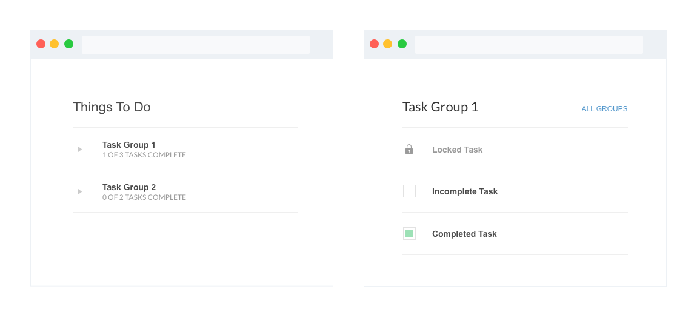

# Fancy To-do List

This project involves building a task list. Tasks belong to groups and can have
dependencies on one another (i.e. if task X depends on task Y, task X cannot be completed until
task Y is completed). 

The UI consists of 2 screens:

* **Overview**: Displays a list of all the groups along with their completion status. Clicking on 
  a group should render the detail screen.

* **Detail**: Displays a list of all the tasks in the selected group and allows the user to toggle the completion status of unlocked tasks.

The screens look like this:

Some things to keep in mind:

* Locked tasks cannot have their completion status toggled
* Tasks remain locked until all of their dependencies have been completed

## Getting Started

This project was bootstrapped with [Create React App](https://github.com/facebook/create-react-app).

In the project directory, you can run:

### `yarn start`

Runs the app in the development mode. 
Open [http://localhost:3000](http://localhost:3000) to view it in the browser.

### `yarn test`

Launches the test runner in the interactive watch mode. 
